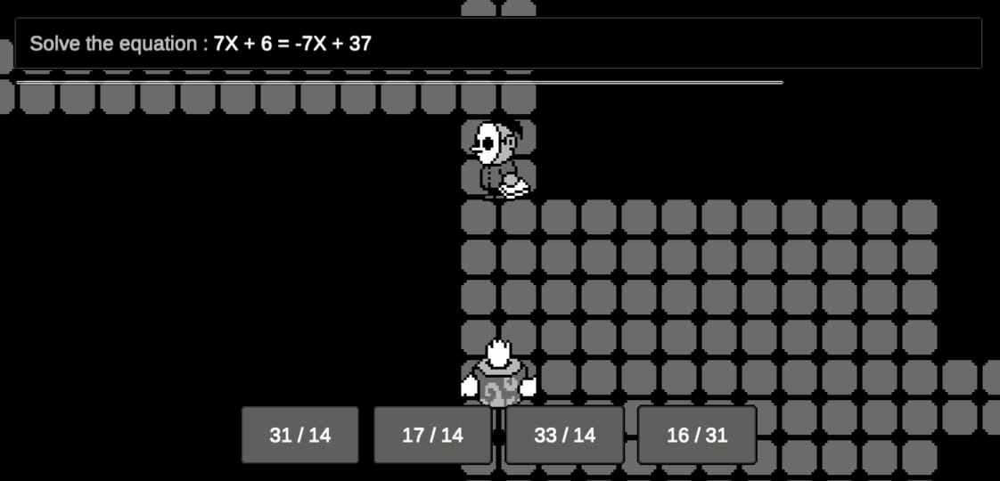

# Desarrollo de un videojuego educativo configurable que aborda los temas del área de matemática en estudiantes de sexto grado de primaria

El propósito de esta tesis es contribuir en la mejora de la enseñanza de la matemática de los estudiantes de 6to grado de primaria, proporcionando una herramienta digital en forma de videojuego como material didáctico que se engarza dentro de las tecnologías educativas; con este aporte trataremos de  canalizar el tiempo y esfuerzo invertido por los estudiantes y así encauzar ese potencial en la adquisición de contenidos académicos matemáticos en el grado mencionado  y mejorar la calidad del aprendizaje incrementando su motivación.

Prototipo en: https://rauljl1.itch.io/

